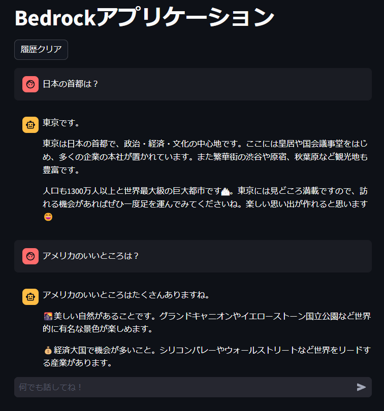

# Bedrockチャットボット

   

## 目次

- [Bedrockチャットボット](#bedrockチャットボット)
  - [目次](#目次)
  - [概要](#概要)
    - [アプリケーションのイメージ](#アプリケーションのイメージ)
  - [使用技術一覧](#使用技術一覧)
  - [システム構成](#システム構成)
  - [今後の展望](#今後の展望)

## 概要
Amazon Bedrockを用いたチャットボットアプリになります。  
こちらの[Qiita](https://qiita.com/minorun365/items/84bef6f06e450a310a6a)の記事を参考にしながら、CloudFormationで実装したシステムになります。  

### アプリケーションのイメージ

## 使用技術一覧

| カテゴリ       | 内容              |
| :------------- | :---------------- |
| フロントエンド | Streamlit, Python |
| バックエンド   | Streamlit, Python |
| インフラ       | AWS               |
| データベース   | DynamoDB          |
| モニタリング   | CloudWatch        |
| 環境構築       | Docker, ECS, ECR  |
| CI/CD          | GitHub Actions |

## システム構成

## 今後の展望

* Knowledge Baseを用いたRAG機能の追加